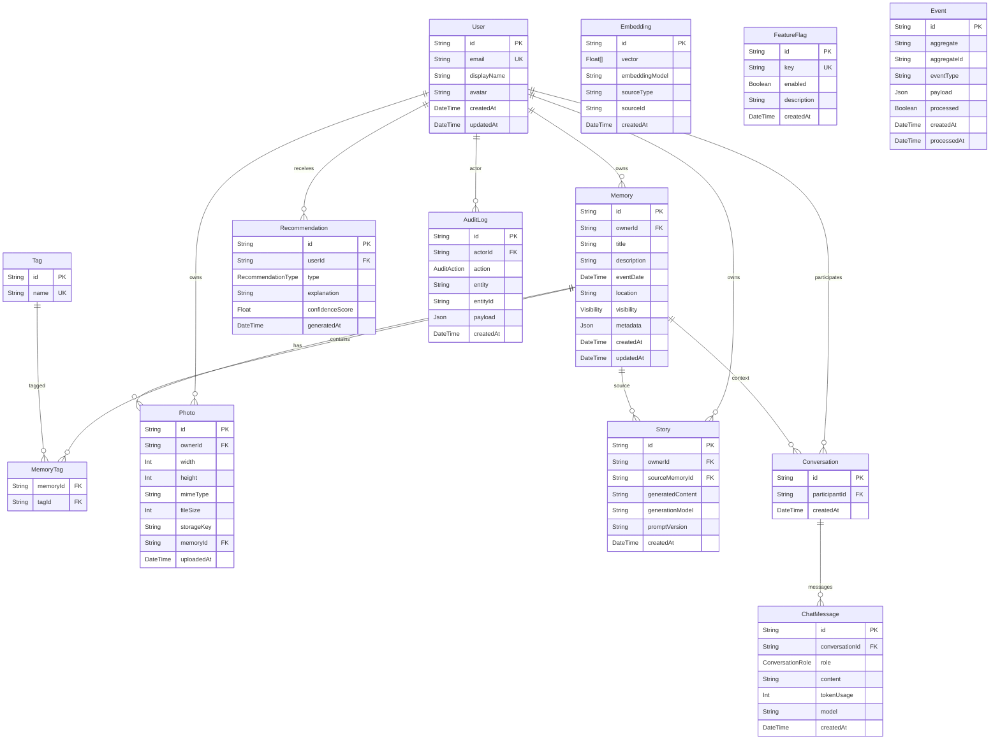

# Aurora X – Entity Relationship Diagram

## ERD (Mermaid)

---

## Notes
- `Embedding` references its source via `sourceType` + `sourceId` (polymorphic, no FK constraint).
- `Event` follows the **transactional outbox pattern** — events written in same DB transaction, consumed asynchronously.
- `FeatureFlag` has no FK to `User` — it is a global configuration table.
